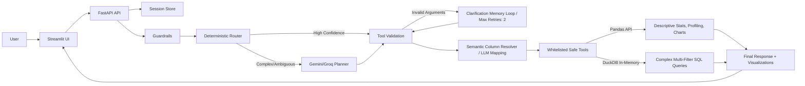

# 🚀 AI Data Analyst Agent

[](https://github.com/AnhPhiNe/ai-data-analyst-agent/actions/workflows/tests.yml)
[](https://fastapi.tiangolo.com/)
[](https://streamlit.io/)
[](https://www.python.org/)
[](https://www.docker.com/)

**AI Data Analyst Agent** is a production-ready, safe, and intelligent tabular data Q&A assistant. Designed as a highly competitive portfolio project for an **AI Engineer Intern/Junior** role, it bridges the gap between natural language (Vietnamese/English) and complex data analytics operations without exposing the system to RCE risks.

---

## 🚀 Live Demo

- **Frontend (Streamlit):** *(Your Streamlit Cloud URL goes here)*
- **Backend API (FastAPI):** *(Your Render/Heroku URL goes here)*

*(Note: If deploying for your portfolio, link your live services above.)*

---

## ✨ Key Features

- **Natural Language Q&A:** Ask analytical questions in Vietnamese or English, and get instant answers without writing SQL or Python.
- **Automated Data Profiling:** Automatically generates a comprehensive dashboard with data quality reports, missing value checks, and numeric summaries upon file upload.
- **Dynamic Visualizations:** Generates interactive Plotly charts (bar, scatter, pie, histogram, correlation heatmaps) based on user requests.
- **Intelligent Clarification Memory:** Retains conversation context and proactively asks follow-up questions if a query is ambiguous (Max retries: 2).
- **Enterprise-Grade Safety:** Uses deterministic routing for standard tasks and Sandboxed DuckDB SQL for complex filtering, ensuring zero risk of arbitrary code execution.
- **Proactive Data Truncation Warnings:** Automatically truncates heavy dataset outputs and alerts the LLM to prevent Context Window overflow.

---

## ⚙️ Pipeline Overview



---

## 📁 Project Structure

```text
ai_data_analyst_agent/
├── backend/
│   ├── agent/          # Orchestration, hybrid router, LLM runtime, memory
│   ├── core/           # Config, logging, rate limit
│   ├── services/       # Upload, profiling, auto-analysis, session store
│   ├── tools/          # Whitelisted Pandas & DuckDB tools
│   └── visualization/  # Chart spec validation
├── frontend/           # Streamlit UI and Plotly rendering
├── tests/              # Unit and API integration tests
├── docs/               # Runbook, eval sets, roadmap
├── scripts/            # Router and golden-answer evaluation scripts
├── data/               # Sample datasets for testing
├── Dockerfile          # Production backend Docker image
└── docker-compose.yml  # Local multi-container orchestration
```

---

## 🛠️ Setup

**1. Clone the repository:**
```bash
git clone https://github.com/AnhPhiNe/ai-data-analyst-agent.git
cd ai-data-analyst-agent
```

**2. Create a virtual environment:**
```bash
python -m venv .venv
# Windows
.\.venv\Scripts\Activate.ps1
# Mac/Linux
source .venv/bin/activate
```

**3. Install dependencies:**
```bash
pip install -r requirements.txt
```

---

## 🔐 Environment Variables

Create a `.env` file in the root directory by copying the example file:
```bash
cp .env.example .env
```

Configure your API keys:
```ini
LLM_PROVIDER=gemini
GEMINI_API_KEY=your_gemini_api_key_here
GEMINI_MODEL=gemini-2.5-flash-lite
# Optional:
GROQ_API_KEY=
GROQ_MODEL=llama-3.3-70b-versatile
MAX_PLANNER_VALIDATION_RETRIES=1
```

---

## ⚡ Run the FastAPI Backend

To start the backend API server locally with hot-reload:
```bash
uvicorn backend.main:app --reload --port 8000
```
- API Documentation (Swagger UI): `http://localhost:8000/docs`

---

## 💬 Run the Streamlit App

In a new terminal window (with the virtual environment activated), start the frontend:
```bash
streamlit run frontend/streamlit_app.py
```
- Web Application: `http://localhost:8501`

---

## ☁️ Deployment Workflow

### Deploying via Docker Compose (Local/VPS)
You can spin up both the backend and frontend simultaneously using Docker:
```bash
docker compose up --build -d
```

### Deploying for a Portfolio (Cloud)
1. **Backend (Render):** Deploy the repository as a Web Service on [Render.com](https://render.com/). Set your `GEMINI_API_KEY` in Render's environment variables.
2. **Frontend (Streamlit Community Cloud):** Connect your GitHub repo to [Streamlit Cloud](https://streamlit.io/cloud). Point the main file to `frontend/streamlit_app.py`. In the Streamlit Cloud Secrets, add:
   ```toml
   BACKEND_URL = "https://your-backend-service.onrender.com"
   ```

---

## 🧪 Local/API Manual Test

Upload one of the sample datasets located in the `/data/` folder and try asking these example queries:

- `Dataset có vấn đề chất lượng dữ liệu gì?` *(Data Quality Profiling)*
- `Cột salary có outlier không?` *(Pandas Outlier Detection IQR)*
- `Tính trung bình doanh thu theo từng phòng ban` *(Pandas Aggregation)*
- `Lọc ra các nhân viên phòng IT có lương > 2000, lấy top 5 người cao nhất` *(DuckDB SQL Fallback)*
- `Vẽ biểu đồ phân phối độ tuổi` *(Plotly Chart Generation)*

---

## ✅ Run Tests, Evaluation

The project maintains a rigorous testing standard to ensure robust routing, tool execution, and code quality.

```bash
# Run Unit Tests
pytest

# Code Formatting & Linting
ruff check .
ruff format --check .
mypy backend

# Evaluate Agent Capabilities
python scripts/evaluate_router.py
python scripts/evaluate_golden_answers.py
```

---
*Built with ❤️ for AI Engineering Interviews.*
