# AI Data Analyst Agent

[](https://github.com/AnhPhiNe/ai-data-analyst-agent/actions/workflows/tests.yml)
[](https://fastapi.tiangolo.com/)
[](https://streamlit.io/)
[](https://www.python.org/)
[](https://www.docker.com/)

AI Data Analyst Agent is a portfolio MVP for safe Vietnamese Q&A over tabular datasets. Users upload a CSV/XLSX file, ask natural-language questions in Vietnamese, and receive an answer, table, chart specification, and agent trace.

The agent does **not** execute arbitrary Python generated by an LLM. It routes questions to a whitelist of pandas-backed tools, validates tool arguments, repairs column names when possible, and asks for clarification when the request is ambiguous.

## What It Shows

- **Agent orchestration:** guardrails, deterministic router, controlled hybrid multi-step planner, optional Gemini/Groq planner fallback, validation, safe execution, response composition.
- **Structured tool calling:** the LLM planner returns a validated JSON tool-selection contract, with local Pydantic validation before execution.
- **Safe analysis tools:** whitelisted pandas-backed operations for profiling, data quality, missing values, outliers, group comparison, aggregation, filtering, percentages, correlation, chart specs, and read-only DuckDB SQL fallback.
- **Column data dictionary:** dataset profiling derives column roles, semantic aliases, sample values, unique ratios, and missingness for planner grounding.
- **Bounded planning:** multi-step plans are limited to a small whitelist of tools and invalid LLM-selected tool calls can be retried once with validation feedback before asking the user to clarify.
- **Vietnamese column resolution:** fuzzy/alias matching for Vietnamese questions over English-style dataset columns.
- **Clarification memory:** follow-up answers can fill missing metric/group/chart arguments.
- **Traceable UX:** frontend shows agent activity so users can inspect router decisions, validation, execution, and errors.
- **Portfolio engineering:** FastAPI backend, Streamlit frontend, Docker Compose, tests, router eval, golden answer eval, structured logs, configurable CORS, and basic rate limiting.

## Architecture

```mermaid
flowchart TD
    U[User] --> FE[Streamlit UI]
    FE --> API[FastAPI API]
    API --> S[Session Store]
    API --> G[Guardrails]
    G --> MS[Controlled Multi-Step Planner]
    MS -->|valid plan| V[Tool Validation]
    MS -->|skip| R[Deterministic Router]
    R -->|high confidence| V
    R -->|ambiguous| C[Clarification]
    R -->|fallback| L[Gemini/Groq Planner]
    L --> V
    V -->|invalid LLM call| PR[Planner Retry With Validation Feedback]
    PR --> V
    V --> CR[Column Argument Repair]
    CR --> T[Whitelisted Pandas/DuckDB Tools]
    T --> A[Answer/Table/Chart Spec]
    A --> FE
```



## Tech Stack

- **Backend:** FastAPI, Pydantic, pandas, NumPy, DuckDB
- **Frontend:** Streamlit, Plotly, httpx
- **AI integration:** Gemini API with `gemini-2.5-flash-lite` by default, optional Groq-compatible planner, JSON planner contract
- **Quality:** pytest, pytest-cov, ruff, mypy, GitHub Actions
- **Deployment demo:** Docker, Docker Compose healthchecks, Render backend config

The dashboard uses deterministic chart recommendation so repeated uploads of the same dataset produce the same chart types and ordering. The configured LLM is used for chat planning, bounded multi-step planning, SQL fallback selection, and optional suggested content, not for changing the dashboard chart set.

## Project Structure

```text
ai_data_analyst_agent/
├── backend/
│   ├── agent/          # orchestration, router, LLM runtime, guardrails
│   ├── core/           # config, logging, rate limit
│   ├── services/       # upload, profiling, auto-analysis, session store
│   ├── tools/          # whitelisted pandas-backed tools
│   └── visualization/  # chart spec validation
├── frontend/           # Streamlit UI and Plotly rendering
├── tests/              # unit and API tests
├── docs/               # runbook, eval sets, roadmap
├── scripts/            # router and golden-answer evaluation scripts
├── data/               # sample datasets
├── Dockerfile
└── docker-compose.yml
```

## Quick Start

### 1. Clone

```bash
git clone https://github.com/AnhPhiNe/ai-data-analyst-agent.git
cd ai-data-analyst-agent
```

### 2. Configure Environment

```bash
cp .env.example .env
```

`GEMINI_API_KEY` and `GROQ_API_KEY` are optional. Without an LLM key, deterministic routing and offline fallback suggestions still work.
`MAX_PLANNER_VALIDATION_RETRIES` controls bounded LLM planner correction after an invalid tool call. The default is `1`.

```ini
LLM_PROVIDER=gemini
GEMINI_API_KEY=
GEMINI_MODEL=gemini-2.5-flash-lite
GROQ_API_KEY=
GROQ_MODEL=llama-3.3-70b-versatile
MAX_PLANNER_VALIDATION_RETRIES=1
```

### 3. Run With Docker Compose

```bash
docker compose up --build
```

- Frontend: `http://localhost:8501`
- Backend docs: `http://localhost:8000/docs`

## Deploy A Live Demo

The recommended portfolio deployment is split into two services:

- **Backend:** Render Web Service running FastAPI from `render.yaml`.
- **Frontend:** Streamlit Community Cloud running `frontend/streamlit_app.py`.

### Backend On Render

1. Push the repository to GitHub.
2. In Render, create a new Blueprint or Web Service from this repo.
3. Use the repository root as the Root Directory.
4. Set `GEMINI_API_KEY` or leave it empty to run deterministic routing only.
5. Keep `LLM_PROVIDER=gemini` and `GEMINI_MODEL=gemini-2.5-flash-lite`.
6. After deployment, copy the generated Render URL, for example `https://your-service.onrender.com`.

### Frontend On Streamlit Cloud

1. Create a Streamlit app from the same GitHub repository.
2. Set the main file path to `frontend/streamlit_app.py`.
3. Add this secret in Streamlit Cloud:

```toml
BACKEND_URL = "https://your-service.onrender.com"
```

If you configure `ALLOWED_ORIGINS` on Render, set it to the Streamlit app URL.

### 4. Local Development

```bash
python -m venv .venv
.\.venv\Scripts\Activate.ps1
pip install -r requirements.txt

uvicorn backend.main:app --reload --port 8000
streamlit run frontend/streamlit_app.py
```

## Evaluation And Quality Checks

```bash
pytest
ruff check .
ruff format --check .
mypy backend
python scripts/evaluate_router.py
python scripts/evaluate_golden_answers.py
```

Current intended eval artifacts:

- Router eval: `docs/route_eval_set.jsonl`
- Golden answer eval: `docs/golden_answer_eval_set.jsonl`
- Sample datasets: `data/sample_student_performance.csv`, `data/sample_sales.csv`, `data/sample_hr.csv`

## Example Questions

- `Dataset có vấn đề chất lượng dữ liệu gì?`
- `Cột salary có outlier không?`
- `So sánh Exam_Score theo Gender`
- `Dataset có bao nhiêu dòng?`
- `Cột nào thiếu dữ liệu?`
- `Trung bình Exam_Score theo Parental_Involvement là bao nhiêu?`
- `Phân phối của Hours_Studied trông như thế nào?`
- `Attendance có tương quan với Exam_Score không?`
- `Tỷ lệ học sinh có Exam_Score trên 80 là bao nhiêu?`

- `Nhóm nào có salary trung bình cao nhất và có outlier không?`
- `So sánh salary theo department và vẽ biểu đồ`
- `Liệt kê top 10 user có salary cao nhất`
- `Lọc các dòng department là Engineering và coef > 5`

## Limitations

This repository is intentionally scoped as a portfolio MVP, not a production analytics platform.

- Sessions are stored in process memory and expire by TTL.
- Uploaded datasets are not persisted to object storage or a database.
- Rate limiting is basic and per-process.
- Guardrails are keyword/pattern based and should not be treated as a full security boundary.
- LLM planner output is still validated by local code before execution.
- The orchestrator is a constrained tool-calling agent with controlled multi-step planning, not an autonomous full ReAct loop.
- DuckDB SQL fallback is read-only, single-table, and bounded by validation plus default result limits; it is not a full BI database layer.
- The app supports one uploaded table per session and does not support multi-file joins.
- Bar charts with categorical `x` and numeric `y` are aggregated in the frontend for display; SQL result tables are returned as tables, not automatically converted into charts.
- The deterministic router eval is a regression suite, not a broad NLU benchmark.
- Multi-worker deployment needs external session/data storage.

## Why This Is Relevant For AI Engineering Intern Roles

The core learning goal is AI systems engineering rather than model training: planning, tool routing, argument validation, safe execution, observability, and graceful failure handling around an LLM-enabled workflow.
