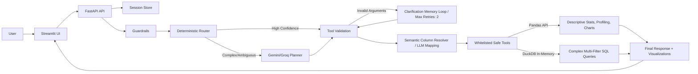

# 🚀 AI Data Analyst Agent

[](https://github.com/AnhPhiNe/ai-data-analyst-agent/actions/workflows/tests.yml)
[](https://fastapi.tiangolo.com/)
[](https://streamlit.io/)
[](https://www.python.org/)
[](https://www.docker.com/)

**AI Data Analyst Agent** is a production-ready, safe, and intelligent tabular data Q&A assistant. Designed as a highly competitive portfolio project for an **AI Engineer Intern/Junior** role, it bridges the gap between natural language (Vietnamese/English) and complex data analytics operations.

Unlike typical LLM wrappers that blindly execute arbitrary Python code (exposing systems to RCE risks), this agent relies on a **robust, whitelisted tool ecosystem** powered by `pandas` and `DuckDB`, orchestrated by a smart Hybrid Routing system.

---

## 🏗️ System Architecture



---

## 🛠️ Tech Stack

- **Backend:** Python 3.11, FastAPI, Pydantic, Pandas, DuckDB
- **Frontend:** Streamlit, Plotly, httpx
- **AI Integration:** Google Gemini API (`gemini-2.5-flash-lite`), Prompt Engineering, Tool Calling
- **Quality & DevOps:** pytest, pytest-cov, ruff, mypy, GitHub Actions, Docker, Docker Compose

---

## 🚀 Quick Start

### 1. Clone & Configure

```bash
git clone https://github.com/AnhPhiNe/ai-data-analyst-agent.git
cd ai-data-analyst-agent
cp .env.example .env
```

Add your API Keys to `.env`:
```ini
LLM_PROVIDER=gemini
GEMINI_API_KEY=your_gemini_api_key_here
GEMINI_MODEL=gemini-2.5-flash-lite
```

### 2. Run Locally (Docker)

```bash
docker compose up --build
```
- UI: `http://localhost:8501`
- Backend API Docs: `http://localhost:8000/docs`

---

## 📊 Evaluation & Testing

The project maintains a rigorous testing standard to ensure robust routing and tool execution.
*(Note: Mock LLM tests for Semantic Column Resolution are currently being updated to match the new architecture).*

```bash
python -m venv .venv
.\.venv\Scripts\Activate.ps1
pip install -r requirements.txt

# Run Quality Checks
pytest
ruff check .
ruff format --check .
mypy backend
```

---

## 💡 Example Queries

Upload a CSV/Excel file and try asking:
- `Dataset có vấn đề chất lượng dữ liệu gì?` *(Data Quality Profiling)*
- `Cột salary có outlier không?` *(Pandas Outlier Detection IQR)*
- `Tính trung bình doanh thu theo từng phòng ban` *(Pandas Aggregation)*
- `Lọc ra các nhân viên phòng IT có lương > 2000, lấy top 5 người cao nhất` *(DuckDB SQL Fallback)*
- `Vẽ biểu đồ phân phối độ tuổi` *(Plotly Chart Generation)*

---

## 🚧 Limitations & Future Work (Scalability Plan)

This project is intentionally designed as an MVP for an internship portfolio. If deployed for enterprise-scale usage (10,000+ concurrent users), the following upgrades are planned:
- **Out-of-Memory (OOM) Prevention:** Migrate from In-Memory Pandas to Disk-based Parquet files utilizing DuckDB's native disk querying capabilities.
- **Stateless Backend:** Move session storage from process memory to Redis.
- **Data Persistence:** Upload files to Cloud Storage (AWS S3) instead of local temp directories.

---
*Built with ❤️ for AI Engineering Interviews.*
