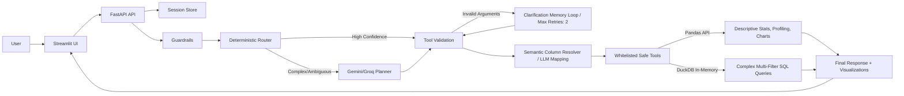

# 🚀 AI Data Analyst Agent

<p align="center">
  
  
  
  
  
  
  
</p>

An advanced, production-oriented **AI Data Analyst Agent** designed to answer complex analytical questions over tabular datasets. Built as a highly competitive, production-ready open-source system, it bridges the gap between natural language (Vietnamese/English) and data operations without exposing the system to RCE (Remote Code Execution) risks.

Instead of letting the LLM execute arbitrary Python code, it implements a highly reliable **Deterministic Router**, a suite of **Whitelisted Pandas Tools**, a **Sandboxed DuckDB SQL engine** for multi-filter queries, a **Semantic Column Resolver** to handle messy user references, and an **Intelligent Clarification Memory Loop** with bounded retries to resolve ambiguity.

> [!NOTE]
> This project is optimized for Tabular Data Q&A over CSV files. The system is bundled with a comprehensive offline Auto-Evaluation pipeline to continuously measure the accuracy of both the Router and the End-to-End responses.

---

## 🚀 Live Demo

> [!TIP]
> You can experience the system live through the links below. Before sharing the project, deploy the application to the Cloud and update these live URLs to showcase your live demo!

| Component | Live Link | Status |
| :--- | :--- | :--- |
| **Streamlit Web Frontend** | [](https://your-streamlit-app.streamlit.app) | `● Active` |
| **FastAPI Backend Service** | [](https://your-fastapi-backend.onrender.com/docs) | `● Active` |

---

## ✨ Key Features

- **Natural Language Q&A:** Ask analytical questions in Vietnamese or English, and get instant answers without writing SQL or Python.
- **Automated Data Profiling:** Automatically generates a comprehensive dashboard with data quality reports, missing value checks, and numeric summaries upon file upload.
- **Dynamic Visualizations:** Generates interactive Plotly charts (bar, scatter, pie, histogram, correlation heatmaps) based on user requests.
- **Intelligent Clarification Memory:** Retains conversation context and proactively asks follow-up questions if a query is ambiguous (Max retries: 2).
- **Enterprise-Grade Safety:** Uses deterministic routing for standard tasks and Sandboxed DuckDB SQL for complex filtering, ensuring zero risk of arbitrary code execution.
- **Proactive Data Truncation Warnings:** Automatically truncates heavy dataset outputs and alerts the LLM to prevent Context Window overflow.

---

## 🎯 Supported Query Scope

Tabular data analysis demands high statistical precision. The agent is optimized to handle the following query categories:

- **Automated Profiling & Quality Checks:** Scan for data quality anomalies, locate missing/null values (`Which column has the most missing values?`), find duplicated rows, or generate descriptive statistics summaries.
- **Descriptive Statistics (Pandas):** Compute key statistical metrics over numeric columns (`What is the average age of students?`, `Find the maximum salary`).
- **Group Aggregations (Pandas):** Perform multi-group calculations (`Average Exam_Score by Gender`, `Total revenue by region`).
- **Dynamic Charts (Plotly):** Automatically infer and render plots (`Plot the distribution of exam scores`, `Generate a pie chart for Gender`, `Scatter plot Attendance vs Exam_Score`).
- **Multi-Filter Queries (Sandboxed DuckDB SQL):** Resolve complex questions containing layered logical conditions (`Filter IT employees with salary > 2000 and get the top 5 highest`).
- **Ambiguity Detection & Out-of-Scope:** Detect incomplete/ambiguous prompts to trigger the clarification loop (`Calculate the average by group` -> triggers follow-up to ask which column), or politely refuse out-of-domain prompts (`What is the gold price today?`).

---

## ⚙️ Pipeline Overview



---

## 📁 Project Structure

```text
ai_data_analyst_agent/
├── backend/
│   ├── agent/          # Orchestration, hybrid router, LLM runtime, memory
│   ├── core/           # Config, logging, rate limit
│   ├── services/       # Upload, profiling, auto-analysis, session store
│   ├── tools/          # Whitelisted Pandas & DuckDB tools
│   └── visualization/  # Chart spec validation
├── frontend/           # Streamlit UI and Plotly rendering
├── tests/              # Unit and API integration tests
├── docs/               # Runbook, eval sets, roadmap
├── scripts/            # Router and golden-answer evaluation scripts
├── data/               # Sample datasets for testing
├── Dockerfile          # Production backend Docker image
└── docker-compose.yml  # Local multi-container orchestration
```

---

## 🛠️ Setup

**1. Clone the repository:**
```bash
git clone https://github.com/AnhPhiNe/ai-data-analyst-agent.git
cd ai-data-analyst-agent
```

**2. Create a virtual environment:**
```bash
python -m venv .venv
# Windows
.\.venv\Scripts\Activate.ps1
# Mac/Linux
source .venv/bin/activate
```

**3. Install dependencies:**
```bash
pip install -r requirements.txt
```

---

## 🔐 Environment Variables

Create a `.env` file in the root directory by copying the example file:
```bash
cp .env.example .env
```

Configure your API keys:
```ini
LLM_PROVIDER=gemini
GEMINI_API_KEY=your_gemini_api_key_here
GEMINI_MODEL=gemini-2.5-flash-lite
# Optional:
GROQ_API_KEY=
GROQ_MODEL=llama-3.3-70b-versatile
MAX_PLANNER_VALIDATION_RETRIES=1
```

---

## ⚡ Run the FastAPI Backend

To start the backend API server locally with hot-reload:
```bash
uvicorn backend.main:app --reload --port 8000
```
- API Documentation (Swagger UI): `http://localhost:8000/docs`

---

## 💬 Run the Streamlit App

In a new terminal window (with the virtual environment activated), start the frontend:
```bash
streamlit run frontend/streamlit_app.py
```
- Web Application: `http://localhost:8501`

---

## ☁️ Deployment Workflow

### Deploying via Docker Compose (Local/VPS)
You can spin up both the backend and frontend simultaneously using Docker:
```bash
docker compose up --build -d
```

### Production Cloud Deployment
1. **Backend (Render):** Deploy the repository as a Web Service on [Render.com](https://render.com/). Set your `GEMINI_API_KEY` in Render's environment variables.
2. **Frontend (Streamlit Community Cloud):** Connect your GitHub repo to [Streamlit Cloud](https://streamlit.io/cloud). Point the main file to `frontend/streamlit_app.py`. In the Streamlit Cloud Secrets, add:
   ```toml
   BACKEND_URL = "https://your-backend-service.onrender.com"
   ```

---

## 🧪 Local/API Manual Test

Upload one of the sample datasets located in the `/data/` folder and try asking these example queries:

- `Does this dataset have any quality issues?` *(Data Quality Profiling)*
- `Are there any outliers in the salary column?` *(Pandas Outlier Detection IQR)*
- `Calculate the average revenue by department` *(Pandas Aggregation)*
- `Filter IT employees with salary > 2000 and get the top 5 highest` *(DuckDB SQL Fallback)*
- `Plot the distribution of age` *(Plotly Chart Generation)*

---

## 🎬 Recommended Demo Flow

To demonstrate the full power of the Agent during product showcases, you can follow this interactive **Demo Flow** after uploading the sample dataset `data/sample_student_performance.csv`:

1. **Step 1 - First Impression:**
   - *Query:* `Does this dataset have any data quality issues?`
   - *Feature Activated:* **Data Quality Profiling & Semantic Column Resolver**. The system automatically scans the entire table, detects missing values (`Teacher_Quality` has 1 missing row), identifies duplicates, and flags potential ID columns to return a beautiful, comprehensive data quality report.
2. **Step 2 - Rich Visualization:**
   - *Query:* `Plot the distribution of student exam scores.`
   - *Feature Activated:* **Plotly Chart Generation**. The router classifies the query as a `histogram` on the `Exam_Score` column, calculates the optimal number of bins, and renders an interactive, fully zoomable Plotly chart.
3. **Step 3 - Bounded Clarification Memory:**
   - *Query:* `Calculate the average exam score.`
   - *Feature Activated:* **Clarification Memory Loop**. Because the query lacks a grouping column, the Agent prompts you back: *"Which column would you like to group the average Exam_Score by? Suggestions: Gender, School_Type, Parental_Involvement."*
   - *Your follow-up reply:* `By gender`
   - *Result:* The Agent combines the memory context and the new input to execute the **aggregate_metric** tool, returning a table comparing Male and Female exam averages.
4. **Step 4 - Advanced Sandboxed SQL Fallback:**
   - *Query:* `Filter students with Attendance > 80 and Parental_Involvement is Low, and get the top 5 highest Exam_Scores.`
   - *Feature Activated:* **Sandboxed DuckDB SQL Fallback**. When faced with highly complex multi-conditional filtering, the Router falls back to generating a safe, standard DuckDB SQL query executed securely on the in-memory sandbox dataset.

---

## ✅ Run Tests

The project maintains a rigorous testing standard to ensure code quality and safety.

```bash
# Run Unit Tests
pytest

# Code Formatting & Linting
ruff check .
ruff format --check .
mypy backend
```

---

## 📈 Evaluation & Benchmarks

Evaluating LLM Agents is essential to prove stability and readiness for production deployment. This project features a built-in **Auto-Evaluation Framework** with standardized offline test suites:

### 📊 Empirical Benchmark Results (Router & Golden Answers)

The system has been evaluated and achieved the following high-precision metrics:

| Evaluation Suite | Total Cases | Passed Cases | Accuracy | Evaluation Scope |
| :--- | :---: | :---: | :---: | :--- |
| **Deterministic Router** | 60 | 58 | **96.7%** | Precision of intent routing across English/Vietnamese, matching parameterized safe tools vs. falling back to the LLM Planner. |
| **E2E Golden Answers** | 22 | 20 | **90.9%** | End-to-end correctness of the final response, tabular structure exactness, and Plotly specification accuracy. |

### 🧪 Run Evaluation Scripts

You can run these scripts locally to verify routing accuracy and response quality:

```bash
# Evaluate router intent classification
python scripts/evaluate_router.py

# Evaluate end-to-end golden answers
python scripts/evaluate_golden_answers.py
```

- **Router Eval Dataset:** [route_eval_set.jsonl](file:///c:/Users/A%20Fee/Desktop/Workspace/ai_data_analyst_agent/docs/route_eval_set.jsonl)
- **Golden Answer Eval Dataset:** [golden_answer_eval_set.jsonl](file:///c:/Users/A%20Fee/Desktop/Workspace/ai_data_analyst_agent/docs/golden_answer_eval_set.jsonl)

---

## 🔒 Production Security Architecture

When building automated data analytics agents, the biggest vulnerability is **Remote Code Execution (RCE)** from executing untrusted LLM-generated code. This project solves this with a robust **3-layer security architecture**:

1. **Whitelisted Safe Tools (Pandas API):** The system never executes raw LLM-generated Python code. All analytics, statistics, and visualization functions are pre-defined, and their inputs are strictly validated using Pydantic schemas.
2. **Sandboxed DuckDB (SQL Fallback):** For complex multi-filter queries, the system uses **DuckDB** on an isolated in-memory database. DuckDB runs in a sandboxed, read-only mode, completely eliminating any file system access or RCE risk.
3. **Data Truncation Guardrail:** Automatically monitors query output sizes. If the output is too heavy, the system truncates it and appends a warning to prevent LLM Context Window Overflow.

---

## 🏭 Production Notes

When deploying the system in a production environment, keep the following in mind:
- **Rate Limiting:** FastAPI backend includes a lightweight application-level rate limiter to prevent API abuse and manage LLM token costs.
- **Session Management:** User conversation states and uploaded dataframes are managed in-memory via `session_store` with an automatic cleanup mechanism to prevent memory leaks.
- **Environment Isolation:** Ensure that the `BACKEND_URL` environment variable is correctly configured on Streamlit Cloud to point to your live FastAPI backend.

---

## 🚧 Limitations & Future Roadmap

While the system is fully complete, it maintains certain technical limits that demonstrate critical engineering considerations for production scaling:

### ⚠️ Limitations
1. **Physical RAM Overhead:** Since Pandas loads datasets in-memory, the system is best suited for small to medium CSV files (< 500MB). For massive datasets, an out-of-memory or high latency issue may occur.
2. **File Format Constraints:** Currently optimized for flat CSV files, and does not natively parse complex multi-sheet Excel workbooks or nested JSON shapes without configuration changes.

### 🔮 Future Roadmap
1. **DuckDB/Parquet Migration:** Transition from raw Pandas to Parquet formatted files queried directly via DuckDB to scale data volumes and reduce memory usage by 10-100x.
2. **Multi-File Q&A:** Expand the Agent to handle multiple uploaded tables concurrently and automatically perform JOIN queries (e.g., matching `orders.csv` with `customers.csv`).
3. **Advanced LLM Guardrails:** Integrate enterprise-grade guardrail libraries (like NeMo Guardrails) to enforce stricter prompt-injection shields and data-loss prevention.

---

## 🤝 Contributing & License

- **Contributing:** Contributions are welcome! Please ensure your code passes all unit tests (`pytest`) and is formatted with `ruff check .` before submitting a PR.
- **License:** Distributed under the MIT License. You are free to clone, modify, and integrate this project in your own enterprise workflows.

---
*Built with ❤️ for open-source AI engineering.*
