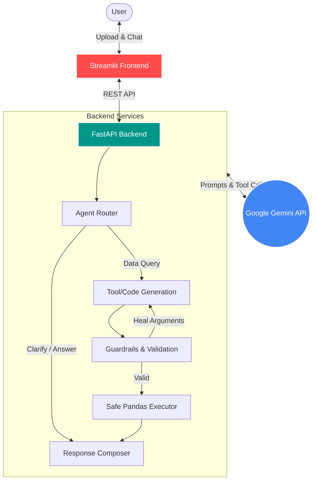

# 📊 AI Data Analyst Agent

[](https://fastapi.tiangolo.com/)
[](https://streamlit.io/)
[](https://www.python.org/)
[](https://www.docker.com/)

An advanced, agentic AI Data Analysis platform that transforms raw tabular data (CSV/Excel) into actionable insights, automated dashboards, and interactive chat experiences. 

Built with a microservices-like architecture separating a **Streamlit frontend** and a **FastAPI backend**, this project leverages LLMs (Google Gemini) with a ReAct-style agentic workflow to safely generate and execute Pandas code for deep data exploration.

---

## ✨ Key Features

- **🧠 Advanced Agentic Workflow:** Uses a Router mechanism to determine if a query requires data manipulation. If yes, it dynamically generates Pandas code, validates it against guardrails, and safely executes it in a sandboxed environment before composing a final response.
- **🛡️ Safe Code Execution & Guardrails:** Built-in tool validation and column argument repair ensure that LLM hallucinations (like made-up column names or unsafe operations) are caught and automatically corrected before execution.
- **📈 Automated Exploratory Data Analysis (EDA):** Instantly generates a comprehensive data profile including missing values, numeric statistics, categorical highlights, and correlation heatmaps upon file upload.
- **🎨 Premium UI/UX:** A highly customized, persistent 3-tab Streamlit interface (Dashboard, Data Explorer, Chat) that goes beyond the default styling, providing a seamless "application-like" experience.
- **📊 Dynamic Visualizations:** Intelligent recommendation engine that automatically selects the most insightful charts (using Plotly) based on the dataset's unique characteristics.
- **🐳 Production Ready:** Fully dockerized with `docker-compose`, comprehensive test suite (`pytest`), and structured following modern Python backend best practices.

---

## 🏗️ System Architecture



---

## 💻 Tech Stack

*   **Frontend:** Streamlit, Pandas, Plotly, HTML/CSS (Custom Styling)
*   **Backend:** FastAPI, Uvicorn, Pydantic, Pandas, NumPy
*   **AI / LLM:** Google GenAI SDK (Gemini)
*   **Infrastructure:** Docker, Docker Compose
*   **Testing & Quality:** Pytest, Ruff, Mypy

---

## 🚀 Quick Start

### Prerequisites
- Docker and Docker Compose installed.
- A Google Gemini API Key.

### 1. Clone the repository
```bash
git clone https://github.com/your-username/ai-data-analyst-agent.git
cd ai-data-analyst-agent
```

### 2. Configure Environment Variables
Create a `.env` file in the root directory:
```bash
cp .env.example .env
```
Add your Gemini API key to the `.env` file:
```ini
GEMINI_API_KEY="your_api_key_here"
```

### 3. Run with Docker Compose (Recommended)
```bash
docker-compose up --build
```
*   **Frontend:** Accessible at `http://localhost:8501`
*   **Backend API Docs (Swagger UI):** Accessible at `http://localhost:8000/docs`

### Alternative: Manual Setup (Local Development)

```bash
# 1. Create virtual environment
python -m venv .venv
source .venv/bin/activate  # On Windows: .venv\Scripts\activate

# 2. Install dependencies
pip install -r backend/requirements.txt
pip install -r frontend/requirements.txt

# 3. Start Backend (Terminal 1)
python -m uvicorn backend.main:app --reload --port 8000

# 4. Start Frontend (Terminal 2)
streamlit run frontend/streamlit_app.py
```

---

## 📁 Project Structure

```text
ai_data_analyst_agent/
├── backend/                  # FastAPI Application
│   ├── agent/                # LLM orchestration, Router, Guardrails, Tool validation
│   ├── core/                 # Config & Logging
│   ├── services/             # Core business logic (Upload, Auto-Analysis, Profiling)
│   ├── tools/                # Safe execution environments for generated code
│   ├── visualization/        # Chart specs & Plotly generation
│   └── main.py               # API Entrypoint
├── frontend/                 # Streamlit Application
│   ├── streamlit_app.py      # Main UI Entrypoint & State Management
│   ├── components.py         # UI Components (Dashboard, Tabs, Chat)
│   └── charts.py             # Plotly rendering logic
├── tests/                    # Pytest suite for backend and agent logic
├── docs/                     # Runbooks & Architecture plans
├── docker-compose.yml
├── Dockerfile
└── README.md
```

---

## 🎯 Example Use Cases

1. **Sales Data:** "Show me the revenue trend over the last 6 months grouped by product category." -> *Agent writes Pandas code to aggregate data and generates a multi-line Plotly chart.*
2. **Titanic Dataset:** "What is the survival rate comparison between male and female passengers across different passenger classes?" -> *Agent processes the categorical columns and returns a structured breakdown.*
3. **Missing Data Handling:** Upload a messy CSV and instantly view a data quality report highlighting exactly which columns need cleaning.

---
*Built as a showcase for advanced AI Engineering & Data Science capabilities.*
