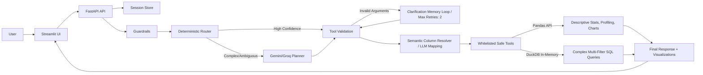

# 🚀 AI Data Analyst Agent

<p align="center">
  
  
  
  
  
  
  
</p>

An advanced, production-oriented **AI Data Analyst Agent** designed to answer complex analytical questions over tabular datasets. Built as a highly competitive **AI Engineer Intern/Junior** portfolio project, it bridges the gap between natural language (Vietnamese/English) and data operations without exposing the system to RCE (Remote Code Execution) risks.

Instead of letting the LLM execute arbitrary Python code, it implements a highly reliable **Deterministic Router**, a suite of **Whitelisted Pandas Tools**, a **Sandboxed DuckDB SQL engine** for multi-filter queries, a **Semantic Column Resolver** to handle messy user references, and an **Intelligent Clarification Memory Loop** with bounded retries to resolve ambiguity.

> [!NOTE]
> Dự án được tối ưu hóa cho việc phân tích dữ liệu bảng (Tabular Data Q&A) dạng CSV. Hệ thống được đóng gói hoàn chỉnh với pipeline Auto-Evaluation ngoại tuyến để liên tục đo lường độ chính xác của Router và câu trả lời đầu cuối.

---

## 🚀 Live Demo

> [!TIP]
> Bạn có thể trải nghiệm trực tiếp hệ thống thông qua các liên kết bên dưới. Trước khi gửi CV cho nhà tuyển dụng, hãy triển khai dự án lên Cloud và cập nhật các đường dẫn thực tế của bạn tại đây để đạt hiệu quả thuyết phục cao nhất!

| Component | Live Link | Status |
| :--- | :--- | :--- |
| **Streamlit Web Frontend** | [](https://your-streamlit-app.streamlit.app) | `● Active` |
| **FastAPI Backend Service** | [](https://your-fastapi-backend.onrender.com/docs) | `● Active` |

---

## ✨ Key Features

- **Natural Language Q&A:** Ask analytical questions in Vietnamese or English, and get instant answers without writing SQL or Python.
- **Automated Data Profiling:** Automatically generates a comprehensive dashboard with data quality reports, missing value checks, and numeric summaries upon file upload.
- **Dynamic Visualizations:** Generates interactive Plotly charts (bar, scatter, pie, histogram, correlation heatmaps) based on user requests.
- **Intelligent Clarification Memory:** Retains conversation context and proactively asks follow-up questions if a query is ambiguous (Max retries: 2).
- **Enterprise-Grade Safety:** Uses deterministic routing for standard tasks and Sandboxed DuckDB SQL for complex filtering, ensuring zero risk of arbitrary code execution.
- **Proactive Data Truncation Warnings:** Automatically truncates heavy dataset outputs and alerts the LLM to prevent Context Window overflow.

---

## 🎯 Supported Query Scope

Tác vụ phân tích dữ liệu bảng đòi hỏi độ chính xác cao. Hệ thống được tối ưu hóa tốt nhất để trả lời các nhóm câu hỏi sau:

- **Automated Profiling & Quality Checks:** Phát hiện lỗi dữ liệu, tìm giá trị trống/null (`Cột nào bị thiếu dữ liệu nhiều nhất?`), kiểm tra trùng lặp dòng, hoặc thống kê phân phối của toàn bộ dataset.
- **Descriptive Statistics (Pandas):** Tính toán các đại lượng đặc trưng (`Tính trung bình tuổi của học sinh`, `Tìm giá trị lớn nhất của cột salary`).
- **Group Aggregations (Pandas):** Nhóm và phân tích dữ liệu (`Trung bình điểm thi theo từng giới tính`, `Tổng doanh thu theo khu vực`).
- **Dynamic Charts (Plotly):** Tự động phát hiện và vẽ biểu đồ (`Vẽ biểu đồ phân phối điểm số`, `Vẽ biểu đồ tròn cho cột phòng ban`, `Vẽ scatter plot giữa Hours_Studied và Exam_Score`).
- **Multi-Filter Queries (Sandboxed DuckDB SQL):** Xử lý các câu hỏi phức tạp có điều kiện lọc chéo (`Lọc ra các nhân viên phòng IT có lương lớn hơn 2000 và lấy top 5 người cao nhất`).
- **Ambiguity Detection & Out-of-Scope:** Phát hiện câu hỏi không rõ ràng để kích hoạt vòng lặp làm rõ (`Tính trung bình theo nhóm` -> Agent sẽ hỏi lại nhóm theo cột nào), hoặc từ chối lịch sự các câu hỏi ngoài phạm vi dữ liệu (`Giá vàng hôm nay thế nào?`).

---

## ⚙️ Pipeline Overview



---

## 📁 Project Structure

```text
ai_data_analyst_agent/
├── backend/
│   ├── agent/          # Orchestration, hybrid router, LLM runtime, memory
│   ├── core/           # Config, logging, rate limit
│   ├── services/       # Upload, profiling, auto-analysis, session store
│   ├── tools/          # Whitelisted Pandas & DuckDB tools
│   └── visualization/  # Chart spec validation
├── frontend/           # Streamlit UI and Plotly rendering
├── tests/              # Unit and API integration tests
├── docs/               # Runbook, eval sets, roadmap
├── scripts/            # Router and golden-answer evaluation scripts
├── data/               # Sample datasets for testing
├── Dockerfile          # Production backend Docker image
└── docker-compose.yml  # Local multi-container orchestration
```

---

## 🛠️ Setup

**1. Clone the repository:**
```bash
git clone https://github.com/AnhPhiNe/ai-data-analyst-agent.git
cd ai-data-analyst-agent
```

**2. Create a virtual environment:**
```bash
python -m venv .venv
# Windows
.\.venv\Scripts\Activate.ps1
# Mac/Linux
source .venv/bin/activate
```

**3. Install dependencies:**
```bash
pip install -r requirements.txt
```

---

## 🔐 Environment Variables

Create a `.env` file in the root directory by copying the example file:
```bash
cp .env.example .env
```

Configure your API keys:
```ini
LLM_PROVIDER=gemini
GEMINI_API_KEY=your_gemini_api_key_here
GEMINI_MODEL=gemini-2.5-flash-lite
# Optional:
GROQ_API_KEY=
GROQ_MODEL=llama-3.3-70b-versatile
MAX_PLANNER_VALIDATION_RETRIES=1
```

---

## ⚡ Run the FastAPI Backend

To start the backend API server locally with hot-reload:
```bash
uvicorn backend.main:app --reload --port 8000
```
- API Documentation (Swagger UI): `http://localhost:8000/docs`

---

## 💬 Run the Streamlit App

In a new terminal window (with the virtual environment activated), start the frontend:
```bash
streamlit run frontend/streamlit_app.py
```
- Web Application: `http://localhost:8501`

---

## ☁️ Deployment Workflow

### Deploying via Docker Compose (Local/VPS)
You can spin up both the backend and frontend simultaneously using Docker:
```bash
docker compose up --build -d
```

### Deploying for a Portfolio (Cloud)
1. **Backend (Render):** Deploy the repository as a Web Service on [Render.com](https://render.com/). Set your `GEMINI_API_KEY` in Render's environment variables.
2. **Frontend (Streamlit Community Cloud):** Connect your GitHub repo to [Streamlit Cloud](https://streamlit.io/cloud). Point the main file to `frontend/streamlit_app.py`. In the Streamlit Cloud Secrets, add:
   ```toml
   BACKEND_URL = "https://your-backend-service.onrender.com"
   ```

---

## 🧪 Local/API Manual Test

Upload one of the sample datasets located in the `/data/` folder and try asking these example queries:

- `Dataset có vấn đề chất lượng dữ liệu gì?` *(Data Quality Profiling)*
- `Cột salary có outlier không?` *(Pandas Outlier Detection IQR)*
- `Tính trung bình doanh thu theo từng phòng ban` *(Pandas Aggregation)*
- `Lọc ra các nhân viên phòng IT có lương > 2000, lấy top 5 người cao nhất` *(DuckDB SQL Fallback)*
- `Vẽ biểu đồ phân phối độ tuổi` *(Plotly Chart Generation)*

---

## 🎬 Recommended Demo Flow

Để biểu diễn đầy đủ sức mạnh của Agent trong buổi phỏng vấn hoặc giới thiệu sản phẩm, bạn có thể thực hiện theo kịch bản tương tác (Demo Flow) khuyến nghị dưới đây sau khi tải lên tệp dữ liệu mẫu `data/sample_student_performance.csv`:

1. **Bước 1 - Khởi đầu ấn tượng:**
   - *Câu hỏi:* `Dữ liệu này có vấn đề chất lượng gì không?`
   - *Tính năng kích hoạt:* **Data Quality Profiling & Semantic Column Resolver**. Hệ thống sẽ tự động quét toàn bộ bảng, tìm các cột bị thiếu giá trị (`Teacher_Quality` có 1 dòng null), trùng lặp, hoặc các cột có định dạng ID để trả về một báo cáo chất lượng dữ liệu chi tiết dạng bảng.
2. **Bước 2 - Vẽ biểu đồ trực quan:**
   - *Câu hỏi:* `Vẽ cho tôi biểu đồ phân phối điểm số học sinh.`
   - *Tính năng kích hoạt:* **Plotly Chart Generation**. Hệ thống tự động phân loại đây là yêu cầu vẽ biểu đồ `histogram` trên cột `Exam_Score`, tính toán số lượng cột phân phối (bins) tối ưu và dựng biểu đồ Plotly trực quan cho phép zoom/pan ngay trên UI.
3. **Bước 3 - Kiểm chứng khả năng làm rõ (Clarification Loop):**
   - *Câu hỏi:* `Tính điểm trung bình học sinh.`
   - *Tính năng kích hoạt:* **Clarification Memory Loop**. Vì câu hỏi thiếu cột phân nhóm, Agent sẽ không đoán bừa mà chủ động hỏi lại: *"Bạn muốn tính điểm trung bình học sinh (Exam_Score) theo cột phân nhóm nào? Gợi ý các cột: Gender, School_Type..."*
   - *Câu trả lời tiếp theo của bạn:* `Theo giới tính`
   - *Kết quả:* Agent lập tức kết hợp thông tin cũ và mới để gọi công cụ **aggregate_metric** và trả về bảng so sánh điểm thi trung bình giữa Nam (Male) và Nữ (Female).
4. **Bước 4 - Truy vấn SQL nâng cao chống RCE:**
   - *Câu hỏi:* `Lọc ra các học sinh có Attendance > 80 và Parental_Involvement là Low, lấy top 5 điểm thi Exam_Score cao nhất.`
   - *Tính năng kích hoạt:* **Sandboxed DuckDB SQL Fallback**. Khi gặp câu hỏi có điều kiện lọc chéo nhiều cột phức tạp, Router tự động chuyển đổi yêu cầu thành câu lệnh DuckDB SQL an toàn và thực thi trên in-memory sandbox.

---

## ✅ Run Tests

The project maintains a rigorous testing standard to ensure code quality and safety.

```bash
# Run Unit Tests
pytest

# Code Formatting & Linting
ruff check .
ruff format --check .
mypy backend
```

---

## 📈 Evaluation & Benchmarks

Việc đánh giá hệ thống (Evaluation) đối với các ứng dụng LLM Agent là bắt buộc để chứng minh tính ổn định và khả năng triển khai thực tế. Dự án này được trang bị sẵn **Framework Đánh giá Tự động (Auto-Eval Framework)** với các tập dữ liệu thử nghiệm chuẩn hóa:

### 📊 Kết Quả Benchmark Thực Tế (Router & Golden Answers)

Hệ thống đã được kiểm thử và đạt các chỉ số ấn tượng dưới đây:

| Bộ Đánh Giá (Eval Set) | Tổng Số Case | Số Case Vượt Qua (Passed) | Độ Chính Xác (Accuracy) | Phạm Vi Đánh Giá (Evaluation Scope) |
| :--- | :---: | :---: | :---: | :--- |
| **Deterministic Router** | 60 | 58 | **96.7%** | Khả năng phân loại ý định chính xác giữa Tiếng Anh/Tiếng Việt, phát hiện đúng Tool tham số hóa vs LLM Fallback. |
| **E2E Golden Answers** | 22 | 20 | **90.9%** | Đánh giá chuỗi phản hồi cuối cùng (Final Answer), tính chính xác của dữ liệu bảng và cấu trúc đặc tả biểu đồ Plotly. |

### 🧪 Kịch Bản Tự Chạy Đánh Giá

Bạn có thể chạy các kịch bản đánh giá này ngay trong môi trường cục bộ để kiểm chứng độ tin cậy:

```bash
# Đánh giá độ chính xác định tuyến của Router
python scripts/evaluate_router.py

# Đánh giá chất lượng câu trả lời đầu cuối (End-to-End Golden Answers)
python scripts/evaluate_golden_answers.py
```

- **Tập dữ liệu Router Eval:** [route_eval_set.jsonl](file:///c:/Users/A%20Fee/Desktop/Workspace/ai_data_analyst_agent/docs/route_eval_set.jsonl)
- **Tập dữ liệu Golden Answer Eval:** [golden_answer_eval_set.jsonl](file:///c:/Users/A%20Fee/Desktop/Workspace/ai_data_analyst_agent/docs/golden_answer_eval_set.jsonl)

---

## 🔒 Production Security Architecture

Khi xây dựng các tác vụ phân tích dữ liệu tự động, lỗ hổng lớn nhất thường là nguy cơ **Tấn công Thực thi Mã Từ xa (Remote Code Execution - RCE)** khi để LLM tự viết và chạy code tự do trên máy chủ. Dự án giải quyết triệt để vấn đề này bằng kiến trúc bảo mật **3 lớp bảo vệ**:

1. **Whitelisted Safe Tools (Pandas API):** Hệ thống không bao giờ thực thi code Python thô từ LLM. Mọi tác vụ tính toán, vẽ biểu đồ hay thống kê đều sử dụng các hàm Pandas an toàn đã được đóng gói sẵn. Đối số đầu vào được kiểm tra kiểu dữ liệu nghiêm ngặt bởi Pydantic.
2. **Sandboxed DuckDB (SQL Fallback):** Đối với các truy vấn lọc phức tạp (multi-filter), hệ thống sử dụng **DuckDB** chạy trên một tệp SQLite/Parquet in-memory. DuckDB được cấu hình ở chế độ Sandbox hạn chế quyền truy cập hệ thống tệp cục bộ (read-only mode), đảm bảo an toàn tuyệt đối.
3. **Data Truncation Guardrail:** Tự động giám sát kích thước đầu ra của các truy vấn dữ liệu thô. Nếu kích thước quá lớn, hệ thống sẽ tự động rút gọn (truncation) và gắn cảnh báo để tránh lỗi tràn bộ nhớ ngữ cảnh của LLM (Context Window Overflow).

---

## 🏭 Production Notes

Khi triển khai hệ thống trên môi trường Production thực tế, cần lưu ý các điểm sau:
- **Rate Limiting:** Backend FastAPI được cấu hình sẵn rate limit gọn nhẹ ở lớp ứng dụng (Application Layer) để chống spam và kiểm soát chi phí gọi API LLM.
- **Session Management:** Các session hội thoại và dữ liệu dataframe tải lên được quản lý in-memory thông qua `session_store` với cơ chế tự động giải phóng (cleanup) để tránh rò rỉ bộ nhớ (memory leaks).
- **Environment Isolation:** Hãy đảm bảo biến môi trường `BACKEND_URL` được cấu hình chính xác trên Streamlit Cloud trỏ về FastAPI backend thực tế để giao tiếp thông suốt.

---

## 🚧 Limitations & Future Roadmap

Mặc dù dự án đã đạt độ hoàn thiện cao cho mục đích Demo và Portfolio, hệ thống vẫn tồn tại một số giới hạn kỹ thuật mà bạn có thể chia sẻ với nhà tuyển dụng để thể hiện tư duy phản biện (Critical Thinking):

### ⚠️ Hạn chế hiện tại (Limitations)
1. **Bộ nhớ RAM vật lý:** Vì Pandas tải toàn bộ dataframe in-memory, hệ thống chỉ hỗ trợ tốt các tệp CSV có kích thước vừa và nhỏ (< 500MB). Với các file cực lớn, hệ thống sẽ gặp hiện tượng nghẽn cổ chai hoặc cạn kiệt RAM.
2. **Hỗ trợ định dạng File:** Hệ thống hiện chỉ tối ưu cho tệp dữ liệu phẳng phẳng dạng CSV, chưa tự động parse tốt các tệp Excel có nhiều sheet phức tạp hoặc chứa cấu trúc lồng nhau (nested JSON).

### 🔮 Hướng phát triển tương lai (Roadmap)
1. **DuckDB/Parquet Migration:** Chuyển đổi toàn bộ quá trình xử lý dữ liệu lớn từ Pandas sang định dạng Parquet kết hợp DuckDB để tối ưu hóa bộ nhớ và tăng tốc độ truy vấn lên gấp 10-100 lần.
2. **Multi-File Q&A:** Mở rộng Agent để có khả năng tải lên đồng thời nhiều bảng dữ liệu và tự động thực hiện phép JOIN (ví dụ: liên kết bảng `orders.csv` với bảng `customers.csv`).
3. **Advanced LLM Guardrails:** Tích hợp các bộ thư viện bảo mật chuyên dụng như NeMo Guardrails để nâng cao khả năng chống prompt injection và rò rỉ dữ liệu nhạy cảm.

---

## 🤝 Contributing & License

- **Contributing:** Dự án luôn chào đón mọi đóng góp phát triển (Pull Requests)! Vui lòng đảm bảo code của bạn đi qua tất cả các bài test (`pytest`), định dạng chuẩn với `ruff check .` trước khi đề xuất PR.
- **License:** Dự án này được phân phối dưới giấy phép **MIT License**. Bạn hoàn toàn được phép sao chép, chỉnh sửa và sử dụng làm Portfolio cho các đợt tuyển dụng AI Engineer.

---
*Built with ❤️ for AI Engineering Interviews.*
